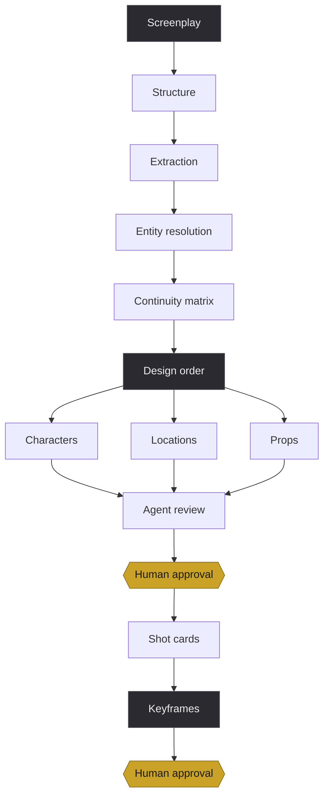

<div align="center">

# vide

**Production infrastructure for AI generated film and episodic drama.**

A screenplay goes in. Out comes every character, set and prop the story needs,
specified and generated and checked, with a shot list and a keyframe for each shot.

</div>

<br>

## The problem

Everything that happens before a frame is generated is still done by hand.

Someone reads the script and writes down the characters. Someone works out that the lead needs nine costumes because the story spans nine days. Someone notices a set that exists only inside an action line and never in a scene heading, so nobody designed it. Someone writes prompts, generates four options, judges them, writes new prompts.

This requires people who know the craft vocabulary. It does not scale. A handful of titles in flight is the ceiling, and the ceiling is human hours rather than compute.

So the platform rests on one idea:

> Expertise belongs in the tooling. Judgement belongs to people.
> Agents handle generation and the first review pass.

A reviewer should never need to know how to phrase a camera instruction. They only need to know whether what came back looks right.

<br>

## How it flows



The gold boxes are gates. They are the only points in the system where anything waits. Everything else runs at once.

<br>

## Capabilities

<table>
<tr>
<td width="33%" valign="top">

### Reading

Accepts `.docx`, `.pdf`, `.html`, `.xlsx`, `.md` and plain text, then splits into episodes and scenes while tolerating the formatting real scripts arrive with.

Structure is parsed, never generated. Scene boundaries and dialogue have exact answers, so a parser handles them: free, instant, repeatable, and unable to invent a scene that was never written.

Every extracted item keeps a span back to its source line.

</td>
<td width="33%" valign="top">

### Planning

Extracts what a production has to build. People named only in action lines. Sets the headings never mention. Props, vehicles, on screen graphics, wardrobe, and the physical states later scenes must match.

Clusters the mess into canonical entities. One script calls a person four things and a room three.

Computes story days deterministically, since that number multiplies into the costume count and cannot drift between runs.

</td>
<td width="33%" valign="top">

### Building

Character sheets, location plates and prop sheets, several candidates each, generated concurrently.

Specifications are written once per entity then pasted verbatim into every prompt that uses them. That repetition is what holds a face steady across hundreds of shots.

Locations build in tiers. A master establishes the space before any view derived from it.

</td>
</tr>
</table>

<br>

### What it refuses to guess

Where nothing in the text settles whether two names mean one thing, the platform raises a question instead of merging quietly. A wrong merge means building one set where two were needed, and that surfaces on screen rather than in a review.

### Checking before a person looks

A vision agent reviews every image against its specification and returns three things: a verdict, a reason written in plain language, and a failure category.

The category carries the weight. "It looks wrong" sends someone guessing. A category states what to change, whether that is one section of a prompt, a simpler shot, or a rebuilt asset underneath.

Rejections are never discarded. They stay visible, a human can override any of them, and those overrides become the signal used to tune the reviewer.

### Shot planning

Scenes split into shots, each carrying a structured card for material, direction, camera and edit. Scene geography is fixed once and inherited by every shot within it, which is what stops a room rearranging itself between cuts.

Keyframes compose from approved assets rather than merely generated ones. A still built on something nobody signed off has to be rebuilt the moment that thing changes.

### Measuring itself

Every model call lands in a log with its prompt, the skill versions behind it, references, outputs, cost and latency. Enough to replay any generation exactly.

That log answers the questions that matter: first pass approval rate, attempts before approval, cost per approved element, which failure categories dominate. Skill versions sit on every row, so two versions of a skill can be compared against the same work rather than argued about.

Numbers that cannot be computed are reported as missing. Never as zero.

<br>

## Principles

| | |
|:--|:--|
| **Gates block, nothing else does** | Work waits on people and on nothing else. |
| **Elements flow independently** | Pipelines are graphs, not phases. One character clearing its gate moves on alone. |
| **Assets precede shots** | Nothing downstream begins until what it depends on carries an approval. |
| **Versions never overwrite** | A variant leaves its parent intact. Changing something upstream marks dependents stale, flagged for a person, never regenerated silently. |
| **One change per attempt** | A regeneration patches the failing section and leaves everything else byte identical. Rewriting a whole prompt loses whatever already worked. |
| **The core knows no models** | Providers and models are configuration. Model specific knowledge lives in adapters and skill documents. |
| **Skills are data** | Agents request a skill by name and the registry returns the active version. Swapping one is configuration. Projects pin versions, which is how comparisons run. |

<br>

## Built with

<div align="center">

| Backend | Frontend | Infrastructure |
|:--|:--|:--|
| Python 3.11 | Next.js | PostgreSQL + pgvector |
| FastAPI | React | Docker |
| SQLAlchemy | TypeScript | S3 compatible storage |
| Alembic | Tailwind | |

</div>

```
src/vide
├── models        projects, scripts, entities, assets, generations, reviews, gates
├── providers     two protocols: fast synchronous text, slow asynchronous media.
│                 Tier configuration maps task to model, so cost scales with the
│                 project rather than with the code
├── registry      versioned skill registry with per project pinning
├── jobs          Postgres backed queue. Horizontal workers, retry with backoff,
│                 reclaimable leases, fan out per element
├── pipeline      ingest, extraction, resolution, continuity, design order,
│                 specifications, prompts, generation, review, shots, keyframes
├── storage       declared object storage layout with drift reconciliation
└── api           HTTP surface

web               review interface
```

The interface is a dense asset grid with a detail overlay, built for someone judging a few hundred images an hour rather than browsing a gallery. Status reads as a hairline along the tile edge instead of a badge, because badges cost the density that makes the view workable at all.

<br>

## Running it

Requires Docker and Python 3.11 or newer.

```bash
docker compose up -d
python3.11 -m venv .venv
.venv/bin/pip install -e ".[dev]"
cp .env.example .env
.venv/bin/alembic upgrade head
```

Confirm every dependency is reachable. This writes nothing and submits no generations.

```bash
.venv/bin/python -m vide.doctor
```

Then bring up the API and the interface.

```bash
.venv/bin/uvicorn vide.api:app --port 8000
cd web && npm install && npm run dev
```

<br>

## Skill documents

Agents load versioned instruction documents at runtime and resolve them by name through the registry.

**Those documents live outside this repository.** They hold production craft and stay private. Everything around them is here: the registry, the versioning, per project pinning, comparison between versions. Supply your own and see [`skills/README.md`](skills/README.md) for the format.

<br>

## Status

Active development, running against real productions.

Preproduction works end to end: a script through to approved assets, shot cards and keyframes. Video generation comes next, and the architecture already accommodates it. The data model, the generation log and the skill registry need no redesign to carry it.
